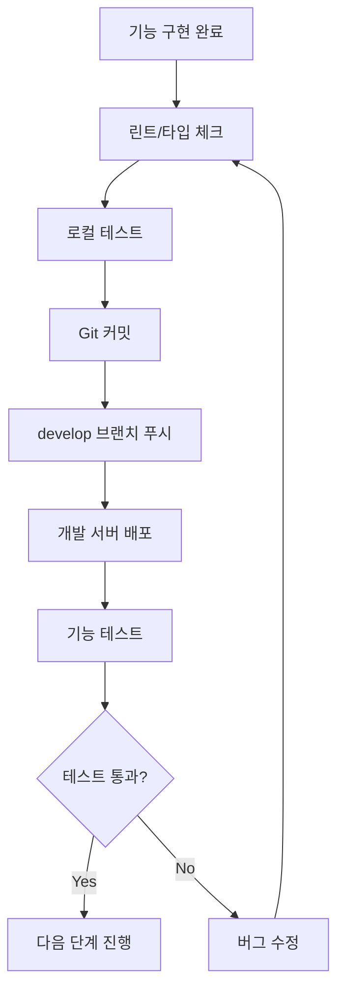

# ERP 시스템 배포 가이드

**작성일**: 2025-11-04
**목적**: 회계 모듈 각 단계 완료 후 배포 및 테스트 워크플로우

---

## 📋 목차

1. [배포 전략](#1-배포-전략)
2. [빠른 시작](#2-빠른-시작)
3. [단계별 배포 프로세스](#3-단계별-배포-프로세스)
4. [배포 스크립트 사용법](#4-배포-스크립트-사용법)
5. [수동 배포 방법](#5-수동-배포-방법)
6. [트러블슈팅](#6-트러블슈팅)

---

## 1. 배포 전략

### 1.1 배포 환경

```
개발 환경 (로컬)
    ↓
develop 브랜치 (개발 서버)
    ↓
main 브랜치 (프로덕션)
```

### 1.2 각 단계 완료 후 워크플로우



### 1.3 배포 빈도

**회계 모듈 구현 시 권장 배포 시점**:
- ✅ STEP 1.4 완료 후 (React Query 훅) - **현재 여기**
- ✅ STEP 1.5 완료 후 (계정과목 목록 페이지)
- ✅ STEP 1.6 완료 후 (등록/수정 폼)
- ✅ STEP 1.7 완료 후 (상세 페이지)
- ✅ PHASE 1 완료 후 (계정과목 관리 전체)
- ✅ STEP 2.5 완료 후 (전표 폼 - 복잡도 높음)
- ✅ PHASE 2 완료 후 (전표 처리 전체)
- ✅ PHASE 3 완료 후 (재무제표)

---

## 2. 빠른 시작

### 2.1 자동 배포 스크립트 사용

```bash
# 프로젝트 루트에서 실행
./scripts/deploy-dev.sh
```

**선택 옵션**:
1. 프론트엔드만 배포
2. 백엔드만 배포
3. 프론트엔드 + 백엔드 모두 배포

### 2.2 3단계 빠른 배포

```bash
# 1. 프론트엔드 빌드 & 실행
cd frontend
npm run lint && npm run type-check && npm run dev

# 2. 백엔드 실행 (별도 터미널)
# IntelliJ에서 SpringBoot Application 실행

# 3. 테스트
# 브라우저: http://localhost:5173
# Swagger: http://localhost:8080/swagger-ui.html
```

---

## 3. 단계별 배포 프로세스

### STEP 1: 코드 품질 검사

```bash
cd frontend

# 1. 린트 검사
npm run lint

# 2. 린트 오류 자동 수정 (가능한 경우)
npm run lint -- --fix

# 3. 타입 체크
npm run type-check

# 4. 테스트 실행 (선택적)
npm run test
```

**✅ 통과 기준**:
- 린트 오류(errors) 0개
- 타입 에러 0개
- 경고(warnings)는 허용 가능

---

### STEP 2: Git 커밋

```bash
# 현재 상태 확인
git status

# 변경사항 확인
git diff

# 스테이징
git add .

# 커밋 (의미 있는 메시지)
git commit -m "feat: 계정과목 React Query 훅 구현

- useAccounts: 목록 조회 훅 추가
- useAccount: 상세 조회 훅 추가
- useAccountTree: 트리 구조 조회 훅 추가
- useCreateAccount: 등록 뮤테이션 추가
- useUpdateAccount: 수정 뮤테이션 추가
- useDeleteAccount: 삭제 뮤테이션 추가
- accountService API 서비스 구현
- accounting.ts 타입 정의

린트 오류 수정:
- 미사용 import 제거
- trailing comma 추가
- prettier 포맷팅 적용
"
```

**커밋 메시지 규칙**:
- `feat:` - 새 기능 추가
- `fix:` - 버그 수정
- `refactor:` - 코드 리팩토링
- `style:` - 코드 포맷팅
- `docs:` - 문서 수정
- `test:` - 테스트 추가/수정
- `chore:` - 빌드/설정 변경

---

### STEP 3: develop 브랜치에 푸시

```bash
# develop 브랜치로 전환
git checkout develop

# main에서 최신 변경사항 가져오기 (필요시)
git merge main

# 원격 저장소에 푸시
git push origin develop
```

---

### STEP 4: 로컬 개발 서버 실행

#### 4.1 프론트엔드

```bash
cd frontend

# 개발 서버 시작
npm run dev

# 또는 빌드 후 프리뷰
npm run build
npm run preview
```

**접속**: http://localhost:5173

#### 4.2 백엔드

**IntelliJ IDEA에서**:
1. `Application.java` 파일 열기
2. 우클릭 → "Run 'Application'"
3. 또는 상단 실행 버튼 클릭

**접속**:
- API: http://localhost:8080
- Swagger: http://localhost:8080/swagger-ui.html

---

### STEP 5: 기능 테스트

#### 5.1 백엔드 API 테스트 (Swagger)

```
1. Swagger UI 접속: http://localhost:8080/swagger-ui.html
2. Accounting Controller 섹션 펼치기
3. 각 API 테스트:
   - GET /api/accounting/accounts (목록 조회)
   - GET /api/accounting/accounts/{id} (상세 조회)
   - GET /api/accounting/accounts/tree (트리 구조)
   - POST /api/accounting/accounts (등록)
   - PUT /api/accounting/accounts/{id} (수정)
   - DELETE /api/accounting/accounts/{id} (삭제)
```

#### 5.2 프론트엔드 테스트

**현재 단계 (1.4 완료) 테스트**:
```javascript
// 브라우저 콘솔에서 React Query DevTools 확인
// 1. React Query DevTools 열기 (우측 하단 아이콘)
// 2. 쿼리 상태 확인:
//    - accounts/list
//    - accounts/detail
//    - accounts/tree
// 3. 뮤테이션 확인:
//    - createAccount
//    - updateAccount
//    - deleteAccount
```

**다음 단계 (1.5 완료 후) 테스트**:
```
1. /accounting/accounts 페이지 접속
2. 계정과목 목록 표시 확인
3. 검색 기능 테스트
4. 필터 기능 테스트
5. 페이지네이션 테스트
```

---

### STEP 6: 회귀 테스트

**기존 기능이 정상 작동하는지 확인**:

```
□ 로그인 정상 작동
□ 대시보드 정상 표시
□ 직원 관리 페이지 정상 작동
□ 재고 관리 페이지 정상 작동
□ 영업 관리 페이지 정상 작동
□ 네비게이션 정상 작동
□ 권한 체크 정상 작동
```

---

### STEP 7: 문제 발견 시

```bash
# 변경사항 임시 저장 (수정 필요 시)
git stash

# 문제 수정

# 린트/타입 체크
npm run lint
npm run type-check

# 다시 커밋
git add .
git commit -m "fix: 발견된 버그 수정"
git push origin develop
```

---

## 4. 배포 스크립트 사용법

### 4.1 스크립트 위치

```
cursor-erp-system/
└── scripts/
    └── deploy-dev.sh
```

### 4.2 실행 방법

```bash
# 프로젝트 루트에서
./scripts/deploy-dev.sh
```

### 4.3 스크립트 기능

1. **Git 상태 확인**
   - 현재 브랜치 표시
   - 커밋되지 않은 변경사항 확인

2. **프론트엔드 배포**
   - npm install
   - 린트 검사
   - 타입 체크
   - 빌드
   - 개발 서버 시작 (선택)

3. **백엔드 배포**
   - Maven 빌드 안내
   - 서버 시작 안내

4. **Git 커밋 도우미**
   - 변경사항 확인
   - 커밋 메시지 입력
   - 자동 커밋 & 푸시

---

## 5. 수동 배포 방법

### 5.1 프론트엔드 수동 배포

```bash
cd frontend

# 1. 의존성 설치
npm install

# 2. 린트 검사 및 수정
npm run lint
npm run lint -- --fix

# 3. 타입 체크
npm run type-check

# 4. 빌드
npm run build

# 5. 프리뷰 (빌드 결과 확인)
npm run preview

# 6. 개발 서버 (개발 중)
npm run dev
```

### 5.2 백엔드 수동 배포

**IntelliJ IDEA**:
```
1. Maven 탭 열기 (우측 사이드바)
2. Lifecycle 펼치기
3. clean 실행
4. install 실행 (테스트 스킵: -DskipTests)
5. Application.java 실행
```

**터미널** (권장하지 않음):
```bash
cd backend

# Maven Wrapper 사용
./mvnw clean install -DskipTests

# Spring Boot 실행
./mvnw spring-boot:run
```

---

## 6. 트러블슈팅

### 6.1 프론트엔드 문제

#### 문제: 린트 오류가 너무 많음
```bash
# 자동 수정 시도
npm run lint -- --fix

# Prettier 포맷팅
npx prettier --write src/

# 특정 파일만 수정
npx eslint src/hooks/useAccounts.ts --fix
```

#### 문제: 타입 에러
```bash
# 타입 에러 자세히 보기
npm run type-check

# tsconfig.json 확인
cat tsconfig.json
```

#### 문제: 빌드 실패
```bash
# node_modules 삭제 후 재설치
rm -rf node_modules package-lock.json
npm install

# 캐시 클리어
npm cache clean --force
```

#### 문제: 개발 서버가 시작되지 않음
```bash
# 포트 사용 중인 프로세스 확인 및 종료
lsof -ti:5173 | xargs kill -9

# 다시 시작
npm run dev
```

---

### 6.2 백엔드 문제

#### 문제: Maven 빌드 실패
```
해결:
1. IntelliJ → File → Invalidate Caches / Restart
2. Maven → Reload All Maven Projects
3. Java 버전 확인 (17 이상 필요)
```

#### 문제: 데이터베이스 연결 오류
```
확인사항:
1. PostgreSQL 서버 실행 중인지 확인
2. application.yml 설정 확인:
   - spring.datasource.url
   - spring.datasource.username
   - spring.datasource.password
3. 포트 충돌 확인 (5432)
```

#### 문제: 포트 8080 이미 사용 중
```bash
# 포트 사용 프로세스 확인 및 종료
lsof -ti:8080 | xargs kill -9

# 다른 포트 사용 (application.yml)
server.port=8081
```

---

### 6.3 Git 문제

#### 문제: 커밋 충돌
```bash
# 원격 변경사항 가져오기
git fetch origin

# 현재 브랜치와 병합
git merge origin/develop

# 충돌 해결 후
git add .
git commit -m "merge: 충돌 해결"
```

#### 문제: 잘못된 커밋 취소
```bash
# 마지막 커밋 취소 (변경사항 유지)
git reset --soft HEAD^

# 마지막 커밋 취소 (변경사항 삭제)
git reset --hard HEAD^

# 특정 파일만 이전 상태로
git checkout HEAD -- <file>
```

---

## 7. 체크리스트

### 7.1 배포 전 체크리스트

```
□ 린트 오류 0개
□ 타입 에러 0개
□ 콘솔 에러 없음
□ 빌드 성공
□ Git 커밋 메시지 명확
□ 테스트 계획 수립
```

### 7.2 배포 후 테스트 체크리스트

```
□ 백엔드 API 응답 정상
□ 프론트엔드 페이지 로딩 정상
□ 새 기능 정상 작동
□ 기존 기능 정상 작동 (회귀 테스트)
□ 권한 체크 정상
□ 에러 핸들링 정상
```

### 7.3 다음 단계 진행 전 체크리스트

```
□ 모든 테스트 통과
□ 코드 리뷰 완료 (팀 작업 시)
□ 문서 업데이트 (필요 시)
□ develop 브랜치 푸시 완료
□ 다음 단계 작업 계획 확인
```

---

## 8. 빠른 참조

### 8.1 주요 명령어

```bash
# 프론트엔드
npm run dev          # 개발 서버
npm run build        # 프로덕션 빌드
npm run preview      # 빌드 미리보기
npm run lint         # 린트 검사
npm run type-check   # 타입 검사

# Git
git status           # 상태 확인
git add .            # 모든 변경사항 스테이징
git commit -m ""     # 커밋
git push             # 푸시
git checkout develop # develop 브랜치로 전환

# 스크립트
./scripts/deploy-dev.sh  # 자동 배포
```

### 8.2 주요 URL

```
프론트엔드: http://localhost:5173
백엔드 API: http://localhost:8080
Swagger UI: http://localhost:8080/swagger-ui.html
```

---

## 9. 현재 단계 (STEP 1.4 완료) 배포 예시

### 9.1 지금 바로 배포하기

```bash
# 1. 자동 배포 스크립트 실행
./scripts/deploy-dev.sh

# 옵션 1 선택: 프론트엔드만
# 옵션 3 선택: 프론트엔드 + 백엔드 모두

# 2. 개발 서버 시작 (Yes 선택)

# 3. 브라우저에서 확인
# - http://localhost:5173 (프론트엔드)
# - http://localhost:8080/swagger-ui.html (백엔드)

# 4. React Query DevTools로 훅 동작 확인
```

### 9.2 테스트 시나리오

```
1. Swagger에서 계정과목 API 테스트
   - GET /api/accounting/accounts
   - POST /api/accounting/accounts
   - GET /api/accounting/accounts/{id}
   - GET /api/accounting/accounts/tree

2. React Query DevTools에서 쿼리 상태 확인
   - accounts 쿼리 캐싱 확인
   - 뮤테이션 실행 확인

3. 콘솔 에러 없는지 확인
```

---

**문서 버전**: 1.0
**최종 업데이트**: 2025-11-04
**다음 업데이트 예정**: STEP 1.5 완료 후
