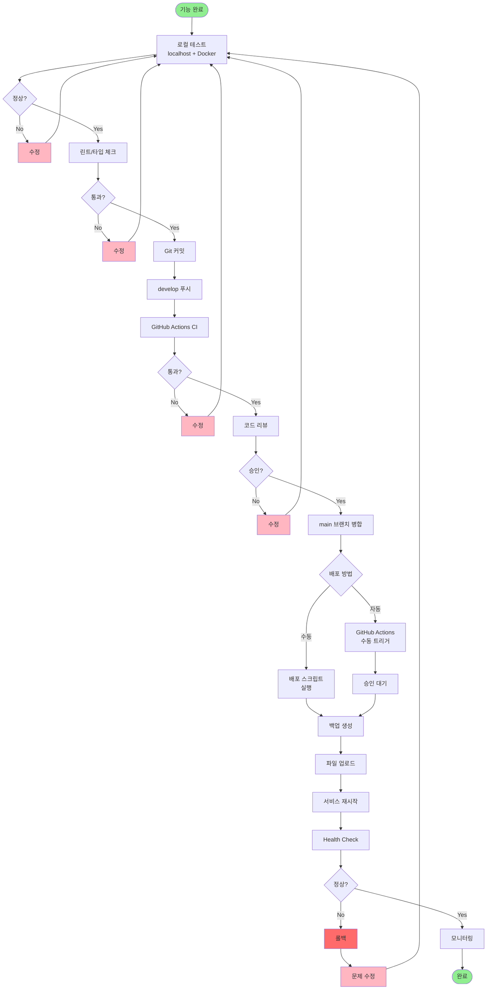

# ERP 시스템 배포 완전 가이드 (최종판)

**작성일**: 2025-11-04
**환경**: 로컬 개발 + 운영 서버 (Ubuntu)

---

## 🎯 배포 전략 요약

```
로컬 개발 (localhost + Docker)
    ↓ 철저한 테스트
develop 브랜치 푸시
    ↓ GitHub Actions CI
코드 리뷰 & 승인
    ↓ main 브랜치 병합
수동 배포 승인
    ↓ 자동 배포 실행
운영 서버
```

---

## 📦 1단계: 로컬 개발 환경 구성

### Docker Compose로 완전한 환경 구축

```bash
# 1. 환경 변수 파일 생성
cp .env.dev.example .env.dev

# 2. 환경 변수 수정 (선택적)
vim .env.dev

# 3. Docker Compose 시작
docker-compose -f docker-compose.dev.yml up -d

# 4. 데이터베이스 확인
# Adminer: http://localhost:8081
# 서버: postgres
# 사용자: erp_user
# 비밀번호: erp_dev_password_2024
# 데이터베이스: erp_dev

# 5. 프론트엔드 개발 서버 시작
cd frontend
npm install
npm run dev
# → http://localhost:5173

# 6. 백엔드 IntelliJ에서 실행
# Application.java 실행
# → http://localhost:8080
# → http://localhost:8080/swagger-ui.html
```

**구성 요소**:
- ✅ PostgreSQL: localhost:5432
- ✅ Redis: localhost:6379
- ✅ Adminer (DB 관리): localhost:8081
- ✅ 프론트엔드: localhost:5173
- ✅ 백엔드: localhost:8080

---

## 📝 2단계: 개발 및 테스트

### 기능 구현

```bash
# 1. 기능 구현
# 예: STEP 1.5 - 계정과목 목록 페이지

# 2. 로컬 테스트
npm run dev
# 브라우저에서 기능 확인

# 3. 린트 & 타입 체크
npm run lint
npm run type-check

# 4. Docker 환경에서 통합 테스트
docker-compose -f docker-compose.dev.yml restart
# 브라우저에서 재확인
```

### 배포 전 체크리스트

```
□ 로컬에서 모든 기능 정상 작동
□ 린트 오류 0개
□ 타입 에러 0개
□ 콘솔 에러 없음
□ Docker 환경에서도 정상 작동
□ 회귀 테스트 완료 (기존 기능 확인)
```

---

## 🔄 3단계: Git 워크플로우

### develop 브랜치 작업

```bash
# 1. develop 브랜치로 전환
git checkout develop

# 2. 변경사항 확인
git status
git diff

# 3. 커밋
git add .
git commit -m "feat: 계정과목 목록 페이지 구현

- 계정과목 목록 조회 페이지 추가
- 검색 기능 구현
- 필터 기능 구현
- 페이지네이션 구현

테스트:
- 로컬 환경 테스트 완료
- Docker 환경 테스트 완료
- 린트/타입 체크 통과
"

# 4. develop 푸시
git push origin develop
```

### GitHub Actions CI 자동 실행

푸시하면 자동으로:
- ✅ 린트 검사
- ✅ 타입 체크
- ✅ 빌드 테스트

**CI 통과 확인**: GitHub → Actions 탭

---

## 🚀 4단계: 운영 서버 배포

### 준비사항

#### 1. 환경 변수 설정

```bash
# 환경 변수 파일 생성
cp .env.production.example .env.production

# 환경 변수 수정 (실제 운영 서버 정보 입력)
vim .env.production
```

**필수 설정 항목**:
```bash
PROD_HOST=your-server.com        # 운영 서버 주소
PROD_USER=ubuntu                  # SSH 사용자
PROD_PORT=22                      # SSH 포트
SSH_KEY=$HOME/.ssh/id_rsa         # SSH 키
PROD_DIR=/home/ubuntu/erp-system  # 배포 디렉토리
```

#### 2. SSH 키 설정

```bash
# SSH 키가 없으면 생성
ssh-keygen -t rsa -b 4096

# 공개 키를 운영 서버에 복사
ssh-copy-id -i ~/.ssh/id_rsa.pub ubuntu@your-server.com

# 접속 테스트
ssh ubuntu@your-server.com
```

#### 3. 운영 서버 준비

```bash
# 운영 서버에 SSH 접속
ssh ubuntu@your-server.com

# Java 17 설치 (없으면)
sudo apt update
sudo apt install -y openjdk-17-jdk

# Nginx 설치 (프론트엔드용)
sudo apt install -y nginx

# PostgreSQL 설치 (없으면)
sudo apt install -y postgresql postgresql-contrib

# 배포 디렉토리 생성
mkdir -p ~/erp-system/{frontend,backend}
```

---

### 방법 1: 수동 배포 스크립트 (권장)

```bash
# 프로젝트 루트에서
./scripts/deploy-production.sh
```

**스크립트가 자동으로 수행**:
1. ✅ SSH 연결 테스트
2. ✅ 배포 전 체크리스트 확인
3. ✅ 원격 서버 백업 생성
4. ✅ 프론트엔드 빌드
5. ✅ 백엔드 빌드
6. ✅ 파일 업로드 (rsync)
7. ✅ 서비스 재시작
8. ✅ Health Check
9. ✅ Git 태그 생성

**실행 화면**:
```
╔════════════════════════════════════════════════════════╗
║       ERP 시스템 운영 서버 배포 스크립트               ║
╚════════════════════════════════════════════════════════╝

배포 대상: ubuntu@your-server.com:/home/ubuntu/erp-system

⚠️  운영 서버에 배포하시겠습니까?
   이 작업은 실제 사용자에게 영향을 미칩니다!

계속 진행하시겠습니까? (yes 입력): yes

[INFO] SSH 연결 테스트 중...
[SUCCESS] SSH 연결 성공
...
```

---

### 방법 2: GitHub Actions 자동 배포

#### GitHub Secrets 설정

**GitHub → Settings → Secrets → Actions**에서 추가:

```
SSH_PRIVATE_KEY       # SSH 개인 키 전체 내용
PROD_HOST            # your-server.com
PROD_USER            # ubuntu
PROD_DIR             # /home/ubuntu/erp-system
```

#### 배포 실행

```bash
# 1. main 브랜치로 develop 병합
git checkout main
git merge develop
git push origin main

# 2. GitHub 웹사이트 접속
# → Actions 탭
# → "Deploy to Production" 선택
# → "Run workflow" 클릭
# → confirm 입력란에 "deploy" 입력
# → "Run workflow" 버튼 클릭

# 3. 배포 진행 모니터링
# → 실시간으로 로그 확인 가능

# 4. Environment 승인
# → "production" 환경 승인 필요 시 승인 버튼 클릭
```

---

## 🔧 5단계: 배포 후 확인

### Health Check

```bash
# 프론트엔드 확인
curl http://your-server.com

# 백엔드 확인
curl http://your-server.com:8080/actuator/health

# 또는 브라우저에서
http://your-server.com
http://your-server.com:8080/swagger-ui.html
```

### 기능 테스트 체크리스트

```
□ 웹사이트 로딩
□ 로그인 기능
□ 계정과목 목록 조회
□ 계정과목 등록
□ 계정과목 수정
□ 계정과목 삭제
□ 검색 기능
□ 필터 기능
□ 페이지네이션
□ 에러 로그 확인 (SSH로 서버 접속)
```

### 로그 확인

```bash
# 운영 서버 SSH 접속
ssh ubuntu@your-server.com

# 백엔드 로그 확인
cd ~/erp-system/backend
tail -f backend.log

# Nginx 로그 확인
sudo tail -f /var/log/nginx/access.log
sudo tail -f /var/log/nginx/error.log
```

---

## 🔙 6단계: 롤백 (문제 발생 시)

### 수동 롤백

```bash
# 롤백 스크립트 실행
./scripts/deploy-production.sh --rollback

# 확인
정말 롤백하시겠습니까? (yes 입력): yes

[INFO] 롤백 중: backup_20251104_153000
[SUCCESS] 롤백 완료
```

### 수동 롤백 (SSH)

```bash
# 운영 서버 접속
ssh ubuntu@your-server.com

# 백업 목록 확인
ls -lh ~/backup_*

# 최신 백업으로 복원
cp -r ~/backup_20251104_153000 ~/erp-system

# 서비스 재시작
pkill -f 'java.*erp.*jar'
cd ~/erp-system/backend
nohup java -jar *.jar > backend.log 2>&1 &
```

---

## 📊 배포 프로세스 전체 흐름



---

## 🛡️ 안전 수칙

### 배포 전 필수 확인

```
❗ main 브랜치인지 확인
❗ 린트/타입 체크 통과
❗ 로컬 + Docker 환경 테스트 완료
❗ 코드 리뷰 승인
❗ 배포 시간 확인 (업무 외 시간 권장)
❗ 백업 생성 확인
❗ 롤백 준비
```

### 배포 후 필수 확인

```
✅ 웹사이트 접속
✅ 로그인 기능
✅ 주요 기능 테스트
✅ 에러 로그 확인
✅ 30분간 모니터링
```

### 절대 금지 사항

```
❌ 운영 DB에서 직접 테스트
❌ 백업 없이 배포
❌ 업무 시간에 배포 (긴급 제외)
❌ 테스트 없이 배포
❌ 승인 없이 자동 배포
```

---

## 📞 빠른 참조

### 주요 명령어

```bash
# 로컬 개발
docker-compose -f docker-compose.dev.yml up -d
npm run dev
./mvnw spring-boot:run

# 배포
./scripts/deploy-production.sh

# 롤백
./scripts/deploy-production.sh --rollback

# 로그 확인
ssh ubuntu@your-server.com "tail -f ~/erp-system/backend/backend.log"
```

### 주요 URL

| 환경 | 프론트엔드 | 백엔드 | Swagger | DB 관리 |
|------|-----------|--------|---------|---------|
| 로컬 | localhost:5173 | localhost:8080 | localhost:8080/swagger-ui.html | localhost:8081 |
| 운영 | your-server.com | your-server.com:8080 | your-server.com:8080/swagger-ui.html | - |

---

## 🎯 다음 단계별 배포 계획

### STEP 1.5 완료 후 (계정과목 목록)

```bash
# 1. 로컬 개발 & 테스트
npm run dev

# 2. Git 커밋 & 푸시
git add .
git commit -m "feat: 계정과목 목록 페이지 구현"
git push origin develop

# 3. develop에서 테스트

# 4. main 병합
git checkout main
git merge develop

# 5. 배포
./scripts/deploy-production.sh
```

### STEP 1.6 완료 후 (등록/수정 폼)

```bash
# 동일한 프로세스 반복
```

### PHASE 1 완료 후 (계정과목 관리 전체)

```bash
# 더 신중하게:
# 1. 철저한 통합 테스트
# 2. 회귀 테스트
# 3. 배포 후 30분 이상 모니터링
```

---

**문서 버전**: 2.0 (최종)
**최종 업데이트**: 2025-11-04
**다음 업데이트**: 필요 시
