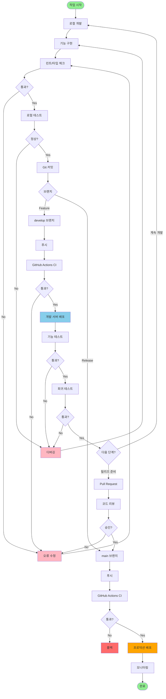
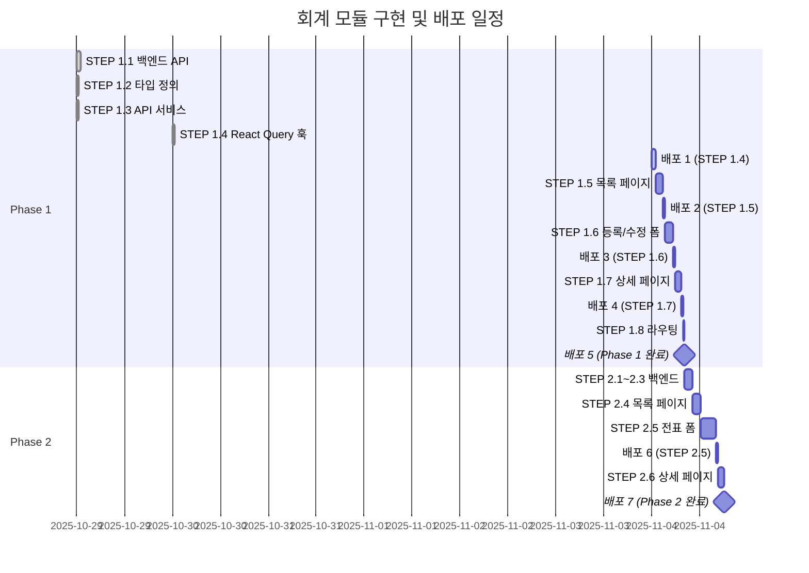
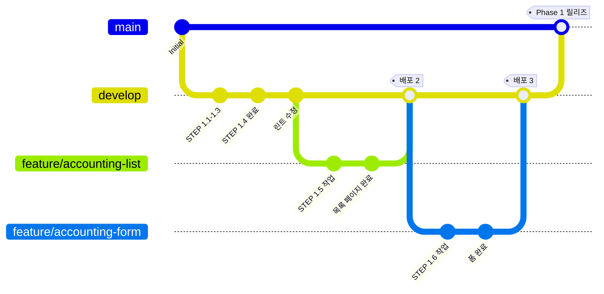
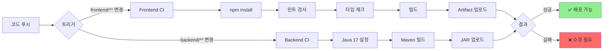
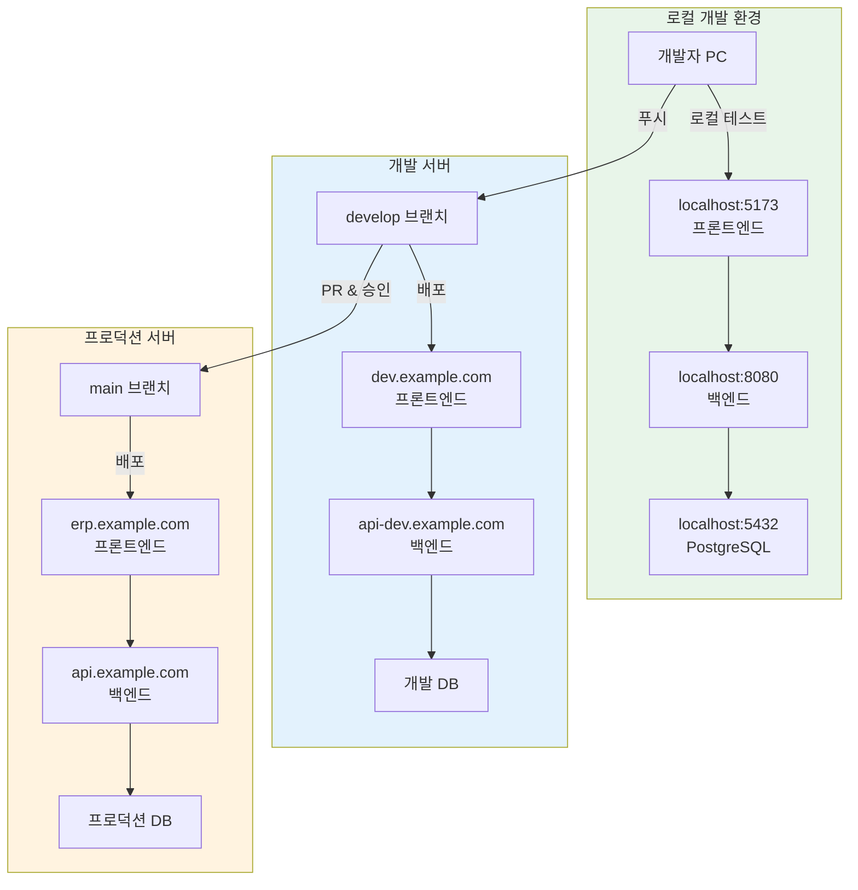
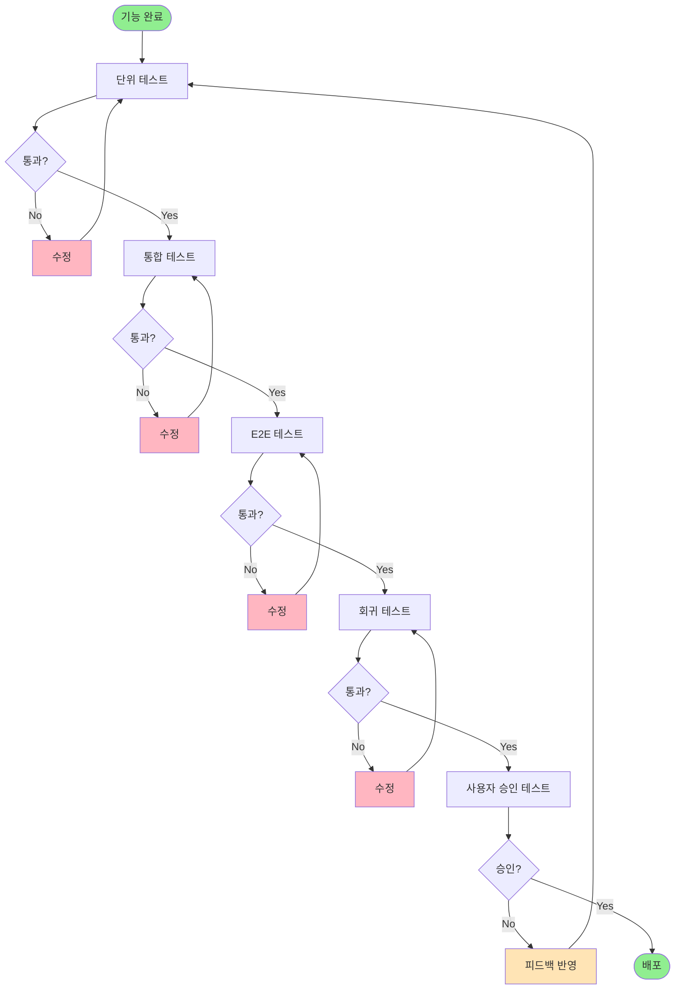
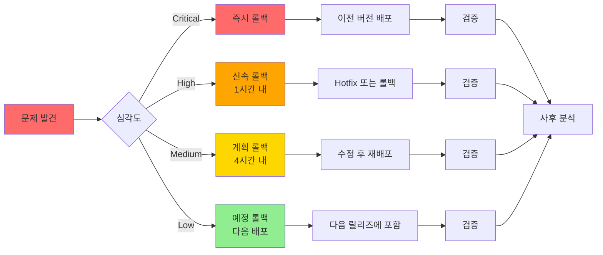
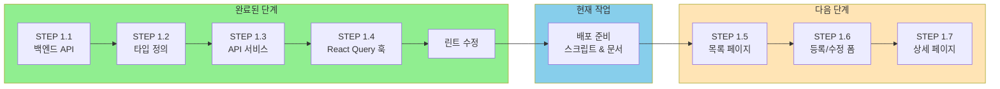
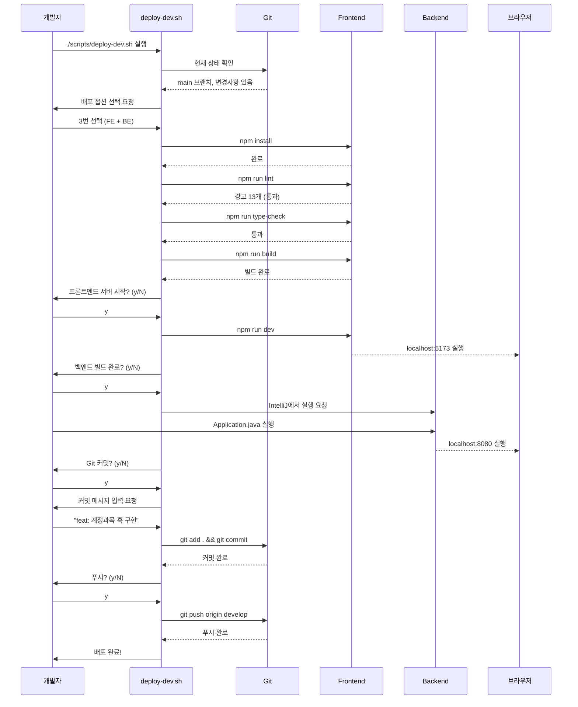

# ERP 시스템 배포 워크플로우 다이어그램

**작성일**: 2025-11-04

---

## 1. 전체 배포 워크플로우

---

## 2. 회계 모듈 단계별 배포

---

## 3. Git 브랜치 전략

---

## 4. CI/CD 파이프라인

---

## 5. 배포 환경별 흐름

---

## 6. 단계별 테스트 전략

---

## 7. 롤백 전략

---

## 8. 현재 상태 (2025-11-04)

---

## 9. 사용 예시

### 9.1 배포 스크립트 실행 흐름

---

**문서 버전**: 1.0
**최종 업데이트**: 2025-11-04
