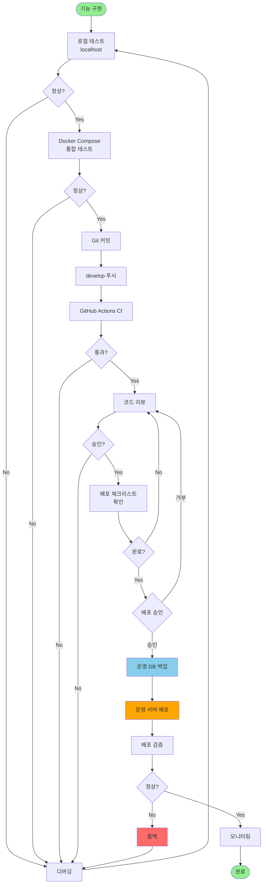

# 배포 전략 분석 및 개선안

**작성일**: 2025-11-04
**현재 상황**: 운영 서버만 존재, SSH 접속 가능

---

## 📊 현재 상황 분석

### 환경 구성
```
현재: 로컬 개발 → [운영 서버만 존재]
문제점: 개발/스테이징 서버 부재
```

### 위험 요소
| 위험 | 심각도 | 설명 |
|------|--------|------|
| 운영 서버 직접 테스트 | 🔴 높음 | 버그가 실사용자에게 즉시 노출 |
| 롤백 어려움 | 🔴 높음 | 문제 발생 시 빠른 복구 어려움 |
| 데이터 손상 위험 | 🔴 높음 | 테스트 중 실제 데이터 영향 |
| 개발 속도 저하 | 🟡 중간 | 신중한 테스트로 개발 속도 느림 |

---

## 💡 권장 솔루션

### 방안 1: 로컬 개발 환경 강화 (즉시 적용 가능) ⭐

**구성**:
```
┌─────────────────────────────────────────┐
│ 로컬 개발 환경 (localhost)               │
├─────────────────────────────────────────┤
│ • 프론트엔드: localhost:5173            │
│ • 백엔드: localhost:8080                │
│ • PostgreSQL: localhost:5432 (Docker)   │
│ • Redis: localhost:6379 (Docker)        │
└─────────────────────────────────────────┘
          ↓ 철저한 테스트
          ↓ Git 푸시 (develop)
          ↓ GitHub Actions CI 통과
          ↓ 코드 리뷰 & 승인
┌─────────────────────────────────────────┐
│ 운영 서버 (수동 배포 또는 승인 후 자동)  │
└─────────────────────────────────────────┘
```

**장점**:
- ✅ 즉시 적용 가능 (추가 서버 불필요)
- ✅ 로컬에서 완전한 환경 재현
- ✅ 운영 서버 안정성 유지
- ✅ 비용 절감

**단점**:
- ❌ 로컬 환경과 운영 환경 차이 가능
- ❌ 팀 작업 시 통합 테스트 어려움

---

### 방안 2: 개발 서버 추가 (이상적) 🏆

**구성**:
```
로컬 개발
    ↓ develop 브랜치 푸시
개발 서버 (자동 배포)
    ↓ 테스트 & 검증
    ↓ main 브랜치 PR
운영 서버 (수동 승인 후 자동 배포)
```

**필요사항**:
- 개발용 서버 1대 (최소 사양 가능)
- 개발용 DB 설정
- 도메인: dev.example.com

**장점**:
- ✅ 운영 환경과 동일한 테스트 환경
- ✅ 팀 작업 시 통합 테스트 용이
- ✅ 운영 서버 안전성 극대화

**단점**:
- ❌ 추가 서버 비용
- ❌ 초기 설정 시간 필요

---

### 방안 3: 로컬 Docker Compose 환경 (절충안) 💎

**구성**:
```yaml
# docker-compose.yml
services:
  frontend:
    build: ./frontend
    ports: ["5173:5173"]

  backend:
    build: ./backend
    ports: ["8080:8080"]

  postgres:
    image: postgres:15
    ports: ["5432:5432"]

  redis:
    image: redis:7
    ports: ["6379:6379"]
```

**장점**:
- ✅ 운영 환경 완벽 재현
- ✅ 팀원 간 환경 통일
- ✅ 격리된 테스트 환경
- ✅ 즉시 적용 가능

**단점**:
- ❌ Docker 학습 곡선
- ❌ 초기 설정 복잡

---

## 🔧 제안하는 최종 전략

### 단계별 적용 계획

#### Phase 1: 즉시 (현재)
```
✅ 로컬 환경 강화
✅ 로컬 Docker Compose 구성
✅ 수동 배포 프로세스 확립
✅ 배포 체크리스트 엄격히 준수
```

#### Phase 2: 1주일 내
```
⏳ GitHub Actions 워크플로우 구성
⏳ 자동 테스트 추가
⏳ 배포 승인 프로세스 구축
```

#### Phase 3: 1개월 내 (선택적)
```
⏳ 개발 서버 추가 검토
⏳ 완전 자동화 배포
⏳ 모니터링 시스템 구축
```

---

## 🚀 즉시 적용 가능한 워크플로우

### 배포 프로세스



---

## 📋 배포 체크리스트 (운영 서버용)

### 배포 전 필수 확인사항

```
□ 로컬에서 모든 기능 테스트 완료
□ Docker Compose 환경에서 통합 테스트 완료
□ 린트/타입 체크 통과 (오류 0개)
□ GitHub Actions CI 통과
□ 코드 리뷰 승인
□ DB 마이그레이션 스크립트 검토
□ 롤백 계획 수립
□ 운영 DB 백업 완료
□ 배포 시간 계획 (사용자 영향 최소화)
□ 모니터링 준비 (로그, 에러 추적)
```

### 배포 중 확인사항

```
□ 서버 접속 확인
□ 기존 프로세스 정상 종료 확인
□ 새 버전 배포 시작
□ 배포 로그 모니터링
□ 서비스 시작 확인
□ Health Check 통과
```

### 배포 후 확인사항

```
□ 기본 기능 정상 작동
□ 새 기능 정상 작동
□ 로그 에러 없음
□ DB 연결 정상
□ API 응답 정상
□ 프론트엔드 로딩 정상
□ 사용자 접속 가능
□ 성능 정상 (응답 시간)
□ 30분간 모니터링
```

---

## 🔒 운영 서버 보호 정책

### 필수 규칙

1. **절대 운영 DB에서 테스트 금지**
   - 로컬 DB 또는 Docker DB 사용

2. **배포 전 백업 필수**
   - DB 백업
   - 코드 백업 (Git 태그)
   - 설정 파일 백업

3. **점진적 배포**
   - Phase별로 나누어 배포
   - 각 Phase 완료 후 검증

4. **즉시 롤백 준비**
   - 이전 버전 보관
   - 롤백 스크립트 준비

5. **배포 시간 제한**
   - 업무 시간 외 배포 권장
   - 긴급 시에만 업무 시간 배포

---

## 🛠️ 다음 단계

제가 다음 파일들을 생성해드리겠습니다:

1. **docker-compose.yml** - 로컬 완전 환경 구성
2. **deploy-production.sh** - 운영 서버 배포 스크립트 (SSH)
3. **배포 승인 워크플로우** - GitHub Actions 수정
4. **롤백 스크립트** - 문제 발생 시 즉시 복구

---

## 💬 질문

계속 진행하기 전에 확인하고 싶습니다:

1. **Docker 사용 경험이 있으신가요?**
2. **운영 서버 OS는 무엇인가요?** (Ubuntu, CentOS 등)
3. **운영 서버에 이미 실행 중인 애플리케이션이 있나요?**
4. **배포 시 서비스 중단이 가능한가요?** (무중단 배포 필요 여부)

---

**권장사항**:
- ✅ 로컬 Docker Compose 환경 먼저 구축
- ✅ 철저한 로컬 테스트
- ✅ 운영 서버는 수동 배포로 시작
- ✅ 안정화 후 자동화 점진적 적용

**위험한 방법**:
- ❌ 운영 서버에 바로 자동 배포
- ❌ 로컬 테스트 없이 배포
- ❌ 백업 없이 배포
